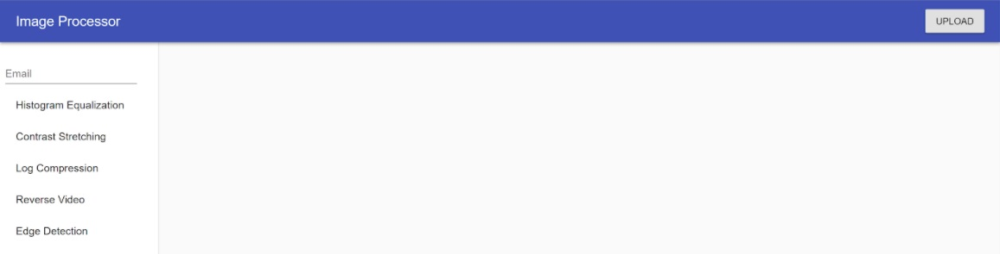

# LaserEye Image Processor  

## Instructions:  
LaserEye Image Processor is an online photo-editing service which allows users to upload images to a web-server, process them with a selection of image processing tools, and download the processed images.  

To use LaserEye Image Processor:  

1. Clone the `master` branch of this repository onto your local machine.
2. Run `npm install` to install the necessary dependencies.
3. Go to the directory imgproc and run `npm run start` to launch app.
4. Navigate to [localhost:3000.](http://localhost:3000)
5. You should see this on the home page: 

6. Enter your email address. This will be your user ID.
7. Select the desired image processing command from the list on the left sidebar.
8. Click 'Upload' to upload the images to process.
9. Upon completion, the processed images will be displayed.
10. Download the images.  

## Others:

#### Documentation:  

1. Navigate to `./docs`
2. Run `make html`
3. Link to documentation will be in `./docs/_build/html/index.html`  

#### RFC:
Link to RFC is [here.](https://docs.google.com/document/d/1FFBqq40pDFD-H9ySttweP7yp4EPdtybOCdWYpvqcGrI/edit?ts=5ace36d4#heading=h.ht3dizgas7v2)
